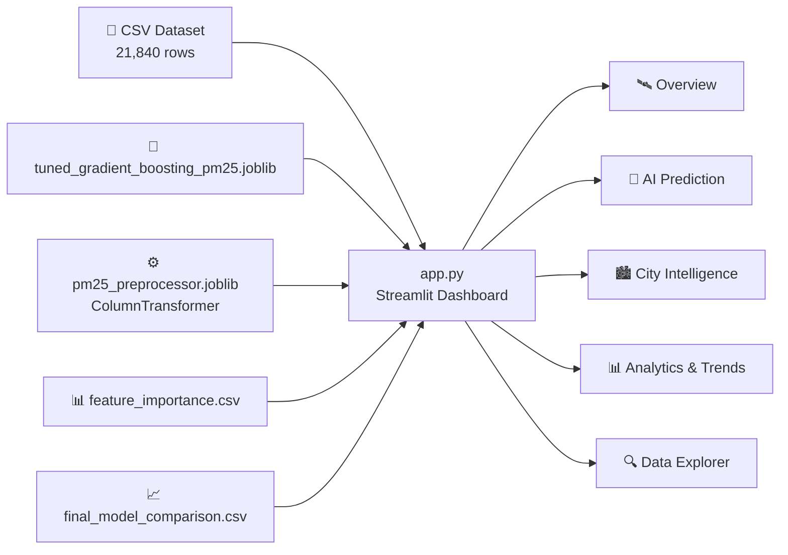

<div align="center">


### 🛰️ Turning 90 days of hourly air-quality data across 10 Pakistani cities into a live, predictive dashboard.

[](https://www.python.org)
[](https://streamlit.io)
[](https://scikit-learn.org)
[](https://pandas.pydata.org)
[](https://plotly.com)
[](https://numpy.org)

[]()
[]()
[]()
[]()
[](#%EF%B8%8F-disclaimer)

<br/>

[](#-quick-start)
[](#-features)
[](#-the-model)
[](#-dataset)
[](#-troubleshooting)

</div>

---

## 📖 Table of Contents

- [🎯 About the Project](#-about-the-project)
- [✨ Features](#-features)
- [🗺️ App Pages](#️-app-pages)
- [🧠 The Model](#-the-model)
- [📊 Dataset](#-dataset)
- [🏗 Architecture](#-architecture)
- [🗂 Project Structure](#-project-structure)
- [🚀 Quick Start](#-quick-start)
- [🩺 Troubleshooting](#-troubleshooting)
- [🛠 Tech Stack](#-tech-stack)
- [⚠️ Disclaimer](#️-disclaimer)
- [🛣 Roadmap](#-roadmap)
- [📄 License](#-license)
- [👨‍💻 Author](#-author)

---

## 🎯 About the Project

**Pakistan Air Intelligence** is an interactive Streamlit dashboard built on 90 days of **hourly** air-quality and weather data across **10 major Pakistani cities**. It combines an explorable analytics layer with a **trained Gradient Boosting model** that forecasts **next-hour PM2.5 concentration** from current pollutant and weather readings.

> 💡 **No mock numbers anywhere.** Every KPI, chart, and ranking in the app is computed live from the dataset and model artifact files — nothing is hardcoded.

---

## ✨ Features

<table>
<tr>
<td width="33%" valign="top">

### 📊 Analytics
- Dataset-wide KPIs & AQI distribution
- Per-city pollution stats & rankings
- PM2.5 / PM10 trend charts
- Multi-pollutant comparison
- Weather-vs-pollution correlation

</td>
<td width="33%" valign="top">

### 🔮 AI Prediction
- Pick a city + hour → forecast
- Tweak readings and re-predict
- Real historical value shown alongside as a sanity check
- Powered by a pre-trained Gradient Boosting model (no retraining in-app)

</td>
<td width="33%" valign="top">

### 🔍 Explore & Export
- Hourly / weekday / monthly / seasonal patterns
- City × Hour pollution heatmap
- Filter by city, AQI, season, date, hour
- One-click **CSV export** of filtered data

</td>
</tr>
</table>

---

## 🗺️ App Pages

| Page | What you get |
|:--|:--|
| 🛰️ **Overview** | Records, cities monitored, avg/max PM2.5, avg PM10, date range, AQI category distribution |
| 🔮 **AI Prediction** | Choose a city & reference hour, optionally edit readings, get a next-hour PM2.5 forecast vs. the real value |
| 🏙️ **City Intelligence** | Per-city statistics + pollutant-by-pollutant ranking across all 10 cities |
| 📊 **Air Quality Analytics** | PM2.5/PM10 trend tabs, pollutant comparison, weather-vs-pollution scatter + correlation heatmap |
| 📈 **Trends & Patterns** | Hourly / day-of-week / monthly / seasonal pollution patterns + City × Hour heatmap |
| 🧠 **Model Intelligence** | Gradient Boosting vs. GRU vs. LSTM comparison, live feature importance |
| 🔍 **Data Explorer** | Filter by city, AQI category, season, date, hour → export as CSV |
| ℹ️ **About** | Dataset background + the project's data-quality correction report |

---

## 🧠 The Model

| Model | MAE ↓ | RMSE ↓ | R² Score ↑ |
|:--|:--:|:--:|:--:|
| **Tuned Gradient Boosting** ⭐ | **4.17** | **6.59** | **0.9795** |
| GRU | 9.92 | 14.00 | 0.9083 |
| LSTM | 20.77 | 32.74 | 0.4983 |

The **Tuned Gradient Boosting Regressor** predicts **next-hour PM2.5** from the current hour's pollutant and weather readings, plus engineered **lag**, **rolling-window**, and **cyclical time** features. By feature importance, the model leans heavily on:

| Feature | Importance |
|:--|:--:|
| Current PM2.5 | ~88.7% |
| Current PM10 | ~6.8% |
| PM2.5 change (1h) | ~1.3% |
| Hour (sin/cos encoding) | ~1.7% combined |
| PM2.5 rolling mean (24h) | ~0.3% |

> ⚙️ The app **never retrains** anything — it loads `tuned_gradient_boosting_pm25.joblib` + `pm25_preprocessor.joblib` and performs inference only. Full EDA, feature engineering, and training steps for GBR/GRU/LSTM are in `assets/pakistan-air-intelligence.ipynb`.

---

## 📊 Dataset

| | |
|:--|:--|
| **Coverage** | 🏙️ Faisalabad · Islamabad · Karachi · Lahore · Multan · Peshawar · Quetta · Rahim Yar Khan · Rawalpindi · Sialkot |
| **Period** | Nov 6, 2025 – Feb 4, 2026, **hourly** resolution |
| **Size** | 21,840 rows × 26 columns |
| **Pollutants** | PM2.5, PM10, CO, NO₂, SO₂, O₃, dust |
| **Weather** | Temperature, humidity, precipitation, wind speed/direction, pressure |
| **Derived fields** | Hour, day of week, month, season, weekend flag, AQI category |

**🩹 Data-quality note (v2):** weather columns were found flat/repeated for a 21-day window at the start of collection, across all cities. This was root-caused and re-fetched from Open-Meteo's historical weather API — pollutant data was unaffected throughout. Full write-up in [`assets/dataset/DATA_QUALITY_REPORT.md`](./assets/dataset/DATA_QUALITY_REPORT.md), and surfaced live in the app's **About** page.

---

## 🏗 Architecture



Training happens once, offline, in `assets/pakistan-air-intelligence.ipynb`. The Streamlit app is a pure **inference + analytics** layer on top of the saved artifacts.

---

## 🗂 Project Structure

```
📦 Pakistan Air Intelligence
├── 📄 app.py                                      → Streamlit application (entry point)
├── 📄 requirements.txt                            → Python dependencies
└── 📁 assets/
    ├── 📁 dataset/
    │   ├── DATA_QUALITY_REPORT.md                 → v2 data-quality correction report
    │   └── pakistan_air_quality_final_clean_v2.csv
    ├── 📁 models/
    │   ├── feature_importance.csv
    │   ├── final_model_comparison.csv
    │   ├── pm25_preprocessor.joblib               → fitted ColumnTransformer
    │   └── tuned_gradient_boosting_pm25.joblib
    ├── 📓 pakistan-air-intelligence.ipynb          → full EDA + feature engineering + training notebook
    └── 📄 Pakistan_Air_Intelligence_SRS.pdf        → software requirements specification
```

---

## 🚀 Quick Start

### 📋 Prerequisites
- **Python 3.10+**
- `pip`

### 🔧 Installation

```bash
git clone https://github.com/AbdulRehman-developer1/Pakistan-Air-Intelligence.git
cd Pakistan-Air-Intelligence
pip install -r requirements.txt
```

> ⚠️ **Important:** the `.joblib` model files were saved with **scikit-learn==1.6.1**. Installing a newer scikit-learn version can raise an `AttributeError` when unpickling them — `requirements.txt` pins the correct version, so don't upgrade it separately.

### ▶️ Run

```bash
streamlit run app.py
```

Opens at **http://localhost:8501** 🎉

---

## 🩺 Troubleshooting

| Problem | Fix |
|:--|:--|
| ❌ `AttributeError` on startup | scikit-learn version mismatch — reinstall with `pip install scikit-learn==1.6.1` |
| 📄 "Dataset not found" | Make sure you run `streamlit run app.py` **from the project root**, so relative paths under `assets/` resolve |
| 🐢 Slow first load | The `.joblib` model + full CSV are read on startup — subsequent interactions are fast (cached) |
| 📦 Large repo size | `assets/dataset/*.csv` and the `.joblib` models are the bulk of the repo size — this is expected |

---

## 🛠 Tech Stack

| Layer | Technology |
|:--|:--|
| Frontend | [Streamlit](https://streamlit.io) + custom CSS |
| Data | [Pandas](https://pandas.pydata.org), [NumPy](https://numpy.org) |
| Visualization | [Plotly](https://plotly.com) |
| ML | [scikit-learn](https://scikit-learn.org) (Gradient Boosting) + [joblib](https://joblib.readthedocs.io) |

---

## ⚠️ Disclaimer

Predictions shown in this app are **AI-generated estimates** based on historical environmental patterns and the supplied input conditions. They are **not certified air-quality readings** and must not be used for medical, regulatory, or emergency decisions.

---

## 🛣 Roadmap

- [ ] Live data ingestion (replace static CSV with a scheduled API pull)
- [ ] Multi-hour / multi-day PM2.5 forecasting (not just next-hour)
- [ ] City-level alerts & notifications for hazardous AQI
- [ ] Public API endpoint for predictions
- [ ] Mobile-friendly layout

---

## 📄 License

Add a `LICENSE` file (e.g. MIT) to the repo root to make usage terms official.

---

<div align="center">

## 👨‍💻 Author

**Abdul Rehman**
*AI Engineer · Data Science & AI Enthusiast*

[](https://github.com/AbdulRehman-developer1)

### ⭐ If this project helped you, consider giving it a star!


</div>
